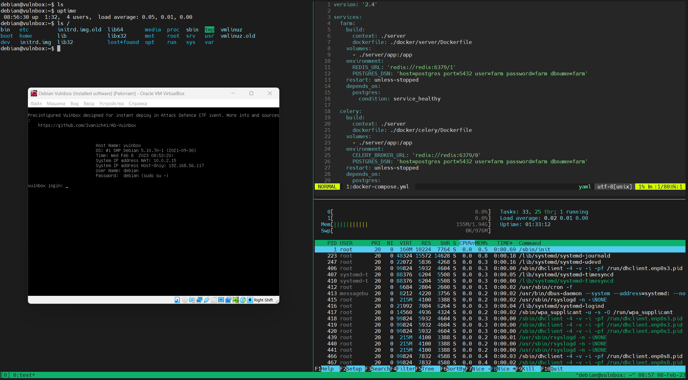
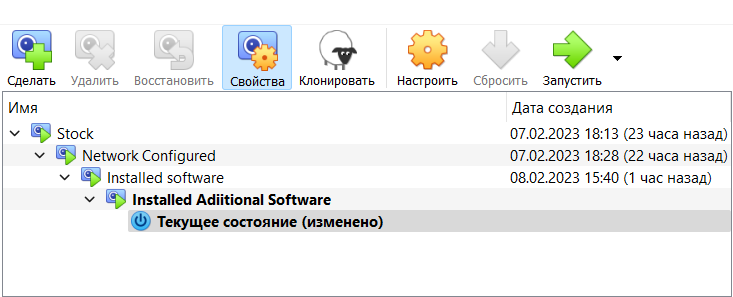
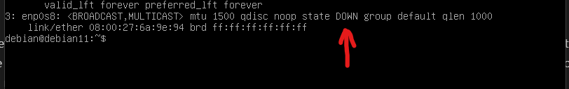
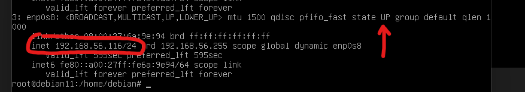
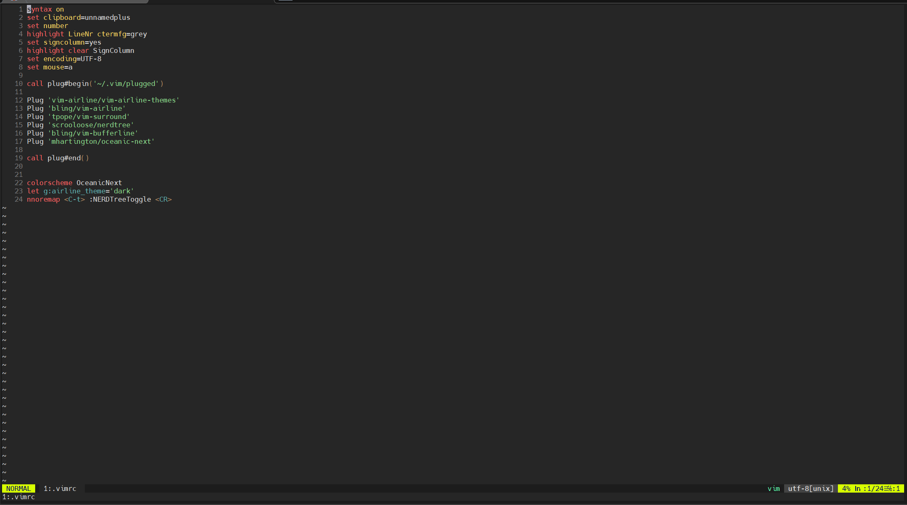
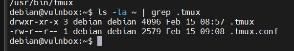
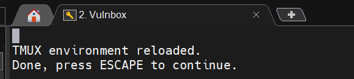
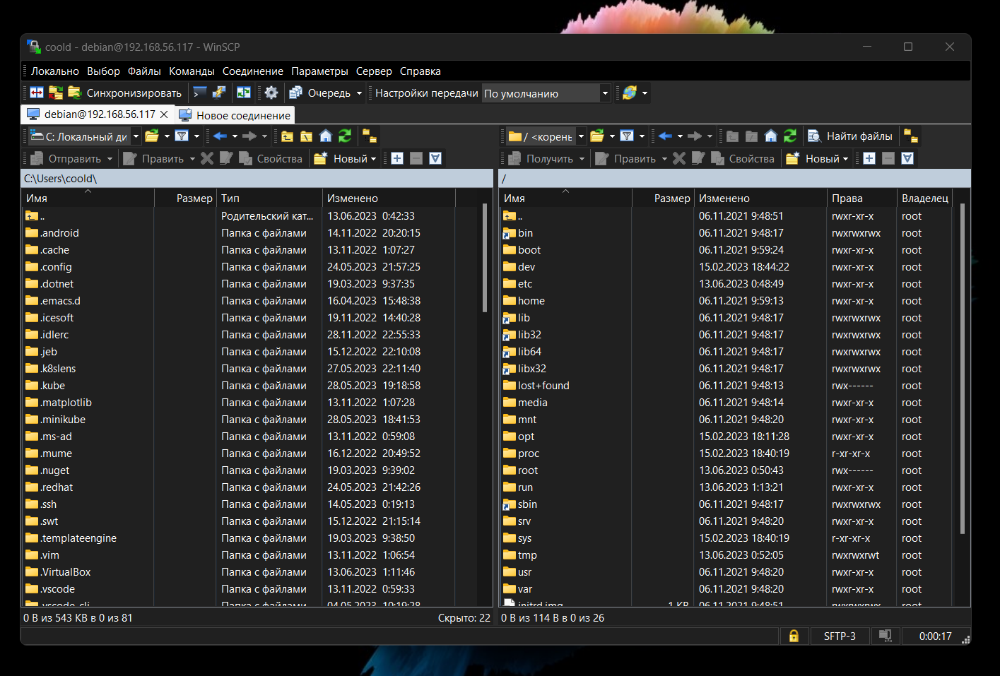
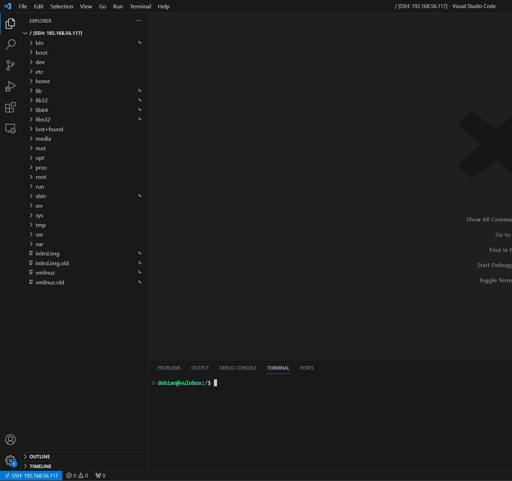
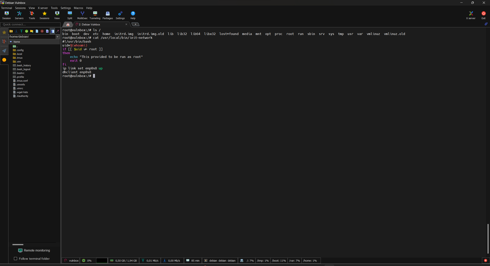

# AD-Vulnbox
Pre-configured virtual machine aka Vulnbox aimed to Attack Defence CTF types.
## TL; DR
A fully configured image can be found [here](https://github.com/Ivanich41/AD-Vulnbox/releases/tag/v2). This Repo contains scripts and configs that had been used during machine setup. You can customize them to improve your usage experience.
### Features 
- Based on Debian 11
- Two network interfaces: NAT and Host-Only
- Default credentials debian:debain (*sudo su -* to became root)
- Preinstalled popular cli tools: git, htop, curl, openvpn, tmux, tldr and neovim
- Neovim and tmux preconfigured for comfortable use
- Installed Docker 
- Downloaded [Packmate](https://gitlab.com/packmate/Packmate.git) - Advanced network traffic flow analyzer for A/D CTFs
- Downloaded [S4DFarm](https://github.com/C4T-BuT-S4D/S4DFarm) - DestructiveFarm fork for automated flags sending

**Note** - Packmate and S4DFarm must be configured manually due to the peculiarities of each event.



## Advanced installation 
### Base image 
I am using Debian 11 as a build base. I prefer pure Virtualbox image from [Linux VM Images website](https://www.linuxvmimages.com/images/debian-11/)(There are also provided VMware images). Alternatively you can use original debian [netinstaller](https://www.debian.org/download) if you want a desktop enviroment for example.

Also, my image assumes several snapshots so that the user can skip some installation steps



All further interactions I recommend to perform by root. 

### Network 
There are two network interfaces in this virtual machine. NAT for internet communications and Host-Only for communications with Host. The second interface is optional, but it allows you to connect to the machine via ssh and have all the functions you need without Desktop Enviroment. You may skip this section if you don't need a local network with a host. 

After login you can see that the second network interface is down and IP didn't assigned. 


To turn interface UP type in terminal this command 
```
ip link set enp0s8 up
```
After that, to assign an IP using a DHCP client, enter this command
```
dhclient enp0s8
```
After that the local IP will be obtained and you can connect to it via ssh


The above actions are also available in the script [init_netwrok.sh](./scripts/init_network.sh)
```bash
wget -qO https://raw.githubusercontent.com/Ivanich41/AD-Vulnbox/main/scripts/init_network.sh | bash
```
### Basic Software 
To update package bases and install software suit type this commands as root. Add or remove any packages as you see fit
```bash
apt update 
apt install -y neovim tmux tldr curl htop git openvpn
```
The above actions are also available in the script [install_stuff.sh](./scripts/install_stuff.sh). Also installs previous init-network script.
```bash
wget -qO https://raw.githubusercontent.com/Ivanich41/AD-Vulnbox/main/scripts/install_stuff.sh | bash
```
### Configure Neovim and Tmux 
**Note** - The configuration will be described for the user root. If you need to configure it for a debian user, do all of the following on that user's behalf with their home directory. Performing these actions from root  can break file access permissions 

Run [deploy_configs.sh](./scripts/deploy_configs.sh) srcipt: 
```bash
wget -qO https://raw.githubusercontent.com/Ivanich41/AD-Vulnbox/main/scripts/deploy_configs.sh | bash
```
Next run 
```
nvim ~/.vimrc 
```
ignore warnings, it's ok

Type 
```
:source %  
```
and hit Enter.
The file ~/.config/nvim/init.vim should be writable, if not, create it manually and paste into
```
set runtimepath^=~/.vim runtimepath+=~/.vim/after
    let &packpath = &runtimepath
    source ~/.vimrc
```
Close this file and open .vimrc again 

Try input *:PlugInstall*. Plugins should be installed. Type :source % for last time to apply theme 
In the end it should look like this 


**Presented Neovim Plugins.**
```lua
Plug 'vim-airline/vim-airline-themes' - Themes for Nepvim status bar.
Plug 'bling/vim-airline' - Powerful status bar.
Plug 'tpope/vim-surround' - Faster text surrounding 
Plug 'scrooloose/nerdtree' - File explorer (Ctrl+T to toggle)
Plug 'bling/vim-bufferline' - Display opened files in status line
Plug 'mhartington/oceanic-next' - Color scheme. Selected by default
```

Next add following line in the end of  **~/.bashrc**:
```
alias tmux="TERM=screen-256color-bce tmux"
```
and then enter
```
tmux source ~/.tmux.conf 
```
This line fixing neovim colors in tmux.

Just in case check  existence of **.tmux** dir in the user's home folder
```
ls -la ~ | grep .tmux
```


After adding alias run tmux and hit Host-key(**Ctrl+A** in my config) and type captital I letter. You should see folowwing message 
 
 
**Presented Tmux Plugins.**
```t
@plugin 'tmux-plugins/tpm' - Tmux plugin manager
@plugin 'tmux-plugins/tmux-resurrect' - Restore tmux session after reboot
@plugin 'tmux-plugins/tmux-yank' - Easy vim-like copy with xclip support
@plugin 'tmux-plugins/tmux-prefix-highlight' - Highligt prefix on status bar then pressed
@plugin 'xamut/tmux-network-bandwidth' - Display network speed on status bar
@plugin 'tmux-plugins/tmux-online-status' - Display online status on status bar
```

### Docker 
To install docker engine run
```
curl -fsSL https://get.docker.com -o get-docker.sh
sh get-docker.sh
```

### Packamate and S4D Farm 
Packmate can be found [here](https://gitlab.com/packmate/Packmate)
```
git clone --recurse-submodules https://gitlab.com/packmate/Packmate.git
```
Before startup edit **.env** in Packmate root folder

S4D Farm [here](https://github.com/C4T-BuT-S4D/S4DFarm.git)
```
git clone https://github.com/C4T-BuT-S4D/S4DFarm.git
```
To configure S4D Farm edit **/server/app/config.py** file. 

# Host to use it
In addition to a simple connection via ssh, I can offer 3 options for interaction.
## GUI SFTP Client 
A good option if you use a cli text editor and a regular terminal/tmux. This will allow you to quickly move between directories in the graphics window without entering the complicated sftp/scp command. Thanks to this method, all team members will be able to quickly upload files.

For windows I reconmend [WinScp](https://winscp.net/eng/download.php), [Cyberduck](https://cyberduck.io) for Mac and [FileZilla](https://filezilla.ru) for Linux.

The main idea of this method is fast access to a remote file system.




## Visual Stuido Code
VS Code fans can install the [ssh plugin](https://code.visualstudio.com/docs/remote/ssh) and edit files remotely.



## [MobaXTerm](https://mobaxterm.mobatek.net) (Windows Only)

Mobaxterm is an advanced administration tool with supportted protocols.
It combines the advantages of the previous methods:
- SSH browser with drag and drop support
- Built in remote text editor
- Remote monitoring window 

Unfortunately, Moba only supports Windows. I tried to run it through emulation on a Mac, but it looked pretty bad.

